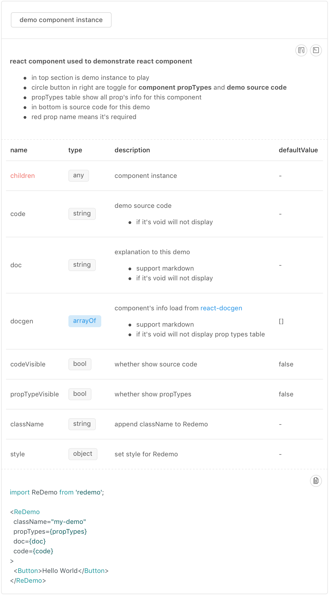

[](https://www.npmjs.com/package/redemo)
[](https://www.npmjs.com/package/redemo)
[](https://npmjs.org/package/redemo)

[中文文档](https://github.com/gwuhaolin/blog/issues/1)

# redemo
When you write a react component, you may need tell others how to use it by write some demos.
Redemo is used to help write demo for react component in a easy way, is't pretty and simple to use.

<p align="center">
  <a href="https://gwuhaolin.github.io/redemo/">
    
  </a>
</p>

## feature
- doc: write doc in markdown for this demo
- code: show source code for this demo
- propTypes: auto list react component `propTypes` document form comment in your component source instead of write by yourself

## install
use it from npm in webpack
```bash
npm i redemo
```

## example
Let's write a demo for a `Button` component

```js
import ReDemo from 'redemo';
import Button from './button';

// load propTypes by docgen-loader from button component source code
const docgen = require('!!docgen-loader!../button');

// load source code by raw-loader from button component source code
const code = require('!!raw-loader!../button');

// write doc for this demo in markdown
const doc = `
### react component used to demonstrate react component
#### structure
- in top section is demo instance to play 
- circle button in right are toggle for **component propTypes** and **demo source code**
- propTypes table show all prop's info for this component
- in bottom is source code for this demo
`

<ReDemo
  className="my-demo"
  docgen={docgen}
  doc={doc}
  code={code}
  defaultCodeVisible
  defaultPropTypeVisible
>
  <Button>demo component instance</Button>
</ReDemo>
```

## API
see `ReDemo`'s all props [here](https://gwuhaolin.github.io/redemo/)

## In practice
- [imuix](http://imweb.github.io/imuix/)